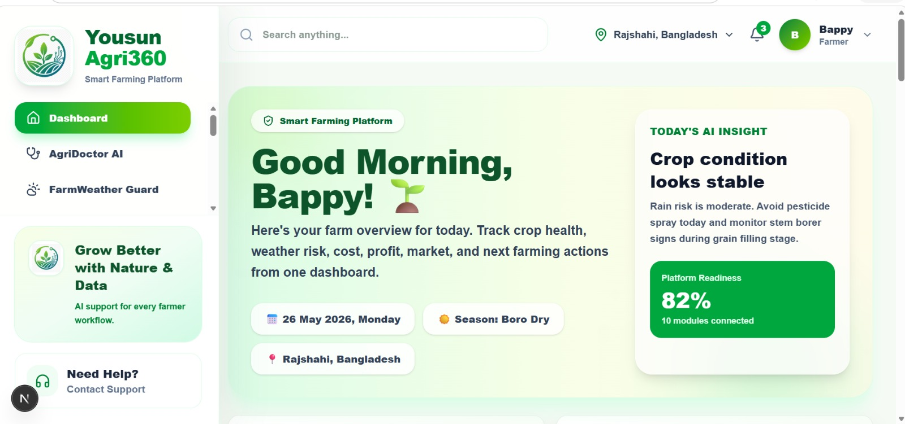

# Yousun Agri360

## AI-Powered 10-in-1 Smart Farming Platform for Small Farmers

Yousun Agri360 is a modular smart farming platform that helps small farmers manage crop health, weather risk, market prices, farm finance, crop planning, selling, credit readiness, voice assistance, reports, and machinery access from one connected dashboard.

This project was built to turn an unfinished agri-tech idea into a polished, working MVP with a professional dashboard, module-based architecture, backend-ready API routes, and a clear real-world impact story.

---

## Live Demo

https://yousun-agri360.vercel.app/

## GitHub Repository

Coming soon.

## Demo Video

Coming soon.

---

## Why This Project Matters

Small farmers often lose money because critical farming decisions are delayed or disconnected. A farmer may need one tool for weather, another for market price, another notebook for expenses, another person for disease advice, and another middleman to sell crops.

Yousun Agri360 brings these scattered workflows into one smart farming operating system.

The goal is simple:

> Help farmers make faster, better, and more profitable farming decisions from one dashboard.

---

## Problem

Small farmers face several real-world problems:

- Crop disease is often detected too late.
- Weather changes can damage crops without warning.
- Farmers do not always know the best market price.
- Farm expenses and profits are often tracked manually.
- Crop timing is difficult to manage.
- Farmers depend heavily on middlemen to sell products.
- Machinery is expensive to buy.
- Loan readiness is difficult to prove.
- Many farmers need simple Bangla-friendly assistance.
- Reports and records are not organized for future planning.

---

## Solution

Yousun Agri360 solves these problems through a 10-in-1 smart farming platform.

Each module works independently, but together they support the full farmer journey from crop planning to selling, finance, credit, and machinery access.

---

## Core Modules

| Module | Purpose |
|---|---|
| AgriDoctor AI | Detect crop disease and provide treatment advice |
| FarmWeather Guard | Generate crop-specific weather risk alerts |
| AgriMarket Link | Compare crop prices and suggest the best market |
| Farm2Market | Help farmers sell crops directly to buyers |
| KrishiBot AI | Answer farming questions through chatbot support |
| AgriCredit AI | Generate farmer credit readiness score |
| KrishiVoice | Provide Bangla voice assistant concept |
| FarmLedger AI | Track expense, income, profit, and ROI |
| CropTime Planner | Generate crop calendar and farming task timeline |
| MachineryShare Agri | Support machinery rental and booking workflow |

---

## Current MVP Status

The current MVP includes a working Next.js dashboard, module pages, and backend-ready API routes.

### Completed

- Professional dashboard UI
- Sidebar navigation
- Topbar farmer profile
- Responsive layout
- 10 module navigation system
- FarmWeather Guard rule-based logic
- CropTime Planner rule-based calendar logic
- API route structure
- Reports route structure
- Backend-ready architecture
- Production build success

### Prototype / Simulated in MVP

Some advanced features are simulated for the MVP version:

- AgriDoctor AI crop disease result
- KrishiBot AI farming responses
- KrishiVoice voice assistant flow
- Market price data
- Weather data
- Machinery listings
- Credit scoring logic

This is intentional. The MVP focuses on showing the complete product workflow, architecture, and real-world usefulness first. The platform is ready to connect with real AI models, APIs, databases, and cloud services later.

---

## Tech Stack

| Area | Technology |
|---|---|
| Framework | Next.js |
| UI Library | React |
| Language | TypeScript |
| Styling | Tailwind CSS |
| Icons | Lucide React |
| Backend Layer | Next.js API Routes |
| Logic | Rule-based MVP functions |
| Data | Mock data |
| Deployment | Vercel-ready |
| Version Control | GitHub |

---

## Project Structure

```txt
yousun-agri360/
│
├── app/
│   ├── api/
│   │   ├── agri-credit/
│   │   ├── agri-doctor/
│   │   ├── crop-calendar/
│   │   ├── farm-ledger/
│   │   ├── reports/
│   │   └── weather-risk/
│   │
│   ├── dashboard/
│   ├── disease-detection/
│   ├── weather-alert/
│   ├── market-price/
│   ├── marketplace/
│   ├── krishibot/
│   ├── agri-credit/
│   ├── krishi-voice/
│   ├── farm-ledger/
│   ├── crop-calendar/
│   ├── machinery-rental/
│   ├── reports/
│   ├── settings/
│   ├── globals.css
│   ├── layout.tsx
│   └── page.tsx
│
├── components/
│   ├── DashboardLayout.tsx
│   ├── Sidebar.tsx
│   ├── Topbar.tsx
│   ├── ModuleCard.tsx
│   ├── StatCard.tsx
│   ├── PageHeader.tsx
│   └── RightPanel.tsx
│
├── data/
│   └── modules.ts
│
├── lib/
│   ├── cropRules.ts
│   ├── calculators.ts
│   └── mockAI.ts
│
├── public/
│   └── screenshots/
│
├── package.json
└── README.md
```

---

## Dashboard Overview

The dashboard is the central control panel for farmers.

It shows:

- Current crop
- Weather risk
- Total expense
- Expected profit
- Soil health
- Irrigation status
- Next farming task
- Market highlights
- Recent activity
- Crop calendar stage
- Quick actions
- All 10 module cards

This makes the platform feel like a complete farmer operating system, not just a single-purpose app.

---

## Module Details

### 1. AgriDoctor AI

AgriDoctor AI helps farmers detect crop disease using image upload and AI-style result generation.

#### Workflow

```txt
Select Crop
  ↓
Upload Leaf or Crop Image
  ↓
Analyze Image
  ↓
Show Disease Result
  ↓
Show Treatment Advice
  ↓
Save Scan Report
```

#### MVP Output

- Disease name
- Confidence score
- Severity level
- Treatment advice
- Organic solution
- Prevention tips
- Recent scan history

#### Future Upgrade

- Real crop disease detection model
- Image segmentation
- Expert consultation
- Disease history tracking

---

### 2. FarmWeather Guard

FarmWeather Guard gives crop-specific weather risk alerts and farming recommendations.

#### Workflow

```txt
Select Location
  ↓
Select Crop
  ↓
Select Weather Condition
  ↓
Generate Risk Score
  ↓
Show Warning, Advice, Avoid List, and Next Action
```

#### MVP Output

- Risk level
- Risk score
- Main warning
- Recommended actions
- Things to avoid
- Next farming action

#### Future Upgrade

- Real weather API
- SMS alert
- Flood and storm forecast
- Crop-specific pest risk prediction

---

### 3. AgriMarket Link

AgriMarket Link helps farmers compare crop prices and choose the best selling market.

#### Workflow

```txt
Select Crop
  ↓
Select District
  ↓
View Market Prices
  ↓
Compare Transport Cost
  ↓
Recommend Best Market
```

#### MVP Output

- Local market price
- District market price
- Wholesale buyer price
- Best selling option
- Price trend concept

#### Future Upgrade

- Real market price API
- Demand prediction
- Buyer matching
- Price alert system

---

### 4. Farm2Market

Farm2Market helps farmers sell crops directly to buyers and reduce dependency on middlemen.

#### Workflow

```txt
Create Crop Listing
  ↓
Add Quantity, Price, Location, and Harvest Date
  ↓
Buyer Places Order
  ↓
Farmer Accepts Order
  ↓
Track Delivery and Payment
```

#### MVP Output

- Product listing
- Buyer order flow
- Order status
- Revenue concept
- Trust score concept

#### Future Upgrade

- Real buyer accounts
- Order management
- Secure payment
- Delivery partner integration

---

### 5. KrishiBot AI

KrishiBot AI is a farming chatbot assistant for quick agricultural guidance.

#### Workflow

```txt
Farmer Asks Question
  ↓
AI Reads Crop Problem
  ↓
AI Gives Farming Advice
  ↓
Suggests Related Module
```

#### MVP Output

- Chat UI
- Farming advice
- Quick question buttons
- Related module suggestions

#### Future Upgrade

- LLM integration
- Bangla farming knowledge base
- Voice and chat combined assistant

---

### 6. AgriCredit AI

AgriCredit AI creates a farmer credit readiness profile based on farm and finance data.

#### Workflow

```txt
Enter Land Size
  ↓
Enter Crop Type
  ↓
Enter Income and Expense
  ↓
Generate Credit Score
  ↓
Suggest Loan Type
```

#### MVP Output

- Credit readiness score
- Risk level
- Suggested loan type
- Reason summary
- Download report concept

#### Future Upgrade

- Bank/MFI integration
- Verified sales record
- Repayment history
- Digital credit profile

---

### 7. KrishiVoice

KrishiVoice is a Bangla-friendly voice assistant concept for farmers who prefer voice interaction.

#### Workflow

```txt
Tap Microphone
  ↓
Speak Farming Question
  ↓
Convert Voice to Text
  ↓
Generate AI Reply
  ↓
Read or Listen to Answer
```

#### MVP Output

- Voice input preview
- Bangla-style answer
- Text-to-speech concept
- Quick voice commands

#### Future Upgrade

- Speech-to-text API
- Text-to-speech API
- Regional language support
- Offline voice command support

---

### 8. FarmLedger AI

FarmLedger AI helps farmers track farm expenses, income, profit, and ROI.

#### Workflow

```txt
Add Expense
  ↓
Add Income
  ↓
Select Crop or Season
  ↓
Calculate Profit or Loss
  ↓
Generate Finance Summary
```

#### MVP Output

- Total expense
- Total income
- Net profit
- ROI
- AI saving tips concept

#### Future Upgrade

- Database-backed records
- PDF financial report
- Seasonal comparison
- Credit score integration

---

### 9. CropTime Planner

CropTime Planner generates crop activity timelines from planting date to harvest.

#### Workflow

```txt
Select Crop
  ↓
Enter Planting Date
  ↓
Generate Crop Timeline
  ↓
Show Irrigation, Fertilizer, Pest Check, Disease Check, and Harvest Tasks
```

#### MVP Output

- Estimated harvest date
- Duration days
- Task timeline
- Task category
- Farming summary

#### Future Upgrade

- SMS task reminders
- Weather-based task adjustment
- Field-specific crop calendar
- Farmer activity history

---

### 10. MachineryShare Agri

MachineryShare Agri helps farmers rent or share farm machinery.

#### Workflow

```txt
Select Machine Type
  ↓
Choose Date and Time
  ↓
View Nearby Machines
  ↓
Check Price and Owner
  ↓
Book Machine
```

#### MVP Output

- Machine listing
- Rental price
- Distance
- Owner rating
- Booking status

#### Future Upgrade

- Real booking system
- Owner verification
- Payment integration
- Map-based machinery discovery

---

## API Routes

The project includes backend-ready API routes.

```txt
/api/agri-doctor
/api/weather-risk
/api/farm-ledger
/api/crop-calendar
/api/agri-credit
/api/reports
```

| API Route | Purpose |
|---|---|
| `/api/agri-doctor` | Simulated crop disease analysis |
| `/api/weather-risk` | Weather risk generation |
| `/api/farm-ledger` | Farm cost, income, profit, and ROI calculation |
| `/api/crop-calendar` | Crop timeline generation |
| `/api/agri-credit` | Farmer credit readiness scoring |
| `/api/reports` | Farm summary report generation |

---

## System Architecture

```txt
Farmer / User
     |
     v
Yousun Agri360 Web Interface
     |
     v
Main Dashboard
     |
     v
Module Pages
     |
     v
Next.js API Routes
     |
     v
Rule-Based Logic / Mock AI / Mock Data
     |
     v
Reports + Recommendations
```

---

## Future Production Architecture

```txt
Frontend: Next.js + TypeScript + Tailwind CSS
     |
Backend: Next.js API Routes or FastAPI
     |
Database: PostgreSQL / Supabase / Firebase
     |
Storage: Supabase Storage / Cloudinary
     |
AI Services:
  - Crop Disease Detection Model
  - LLM Farming Chatbot
  - Voice-to-Text
  - Text-to-Speech
     |
External APIs:
  - Weather API
  - Market Price API
  - Payment API
  - SMS API
```

---

## Data Flow

```txt
Farmer Input
     ↓
Module Page
     ↓
API Route
     ↓
Rule-Based Logic / Mock AI
     ↓
Result Card
     ↓
Dashboard / Reports
```

Example:

```txt
CropTime Planner Input
     ↓
/api/crop-calendar
     ↓
generateCropCalendar()
     ↓
Task Timeline
     ↓
Dashboard Next Task + Reports
```

---

## How GitHub Copilot Helped

GitHub Copilot helped finish the project faster by assisting with:

- Creating reusable React components
- Writing TypeScript types
- Building dashboard card structures
- Suggesting API route patterns
- Reducing repeated UI code
- Creating module page layouts
- Writing rule-based MVP functions
- Improving development speed from unfinished idea to working platform

Copilot was especially helpful for transforming a scattered agri-tech idea into a structured, module-based farming platform.

---

## Before and After Story

### Before

The project started as an unfinished agri-tech idea.

Before finishing:

- No polished dashboard
- No clear module workflow
- No connected farming journey
- No API route structure
- No strong README
- No contest-ready explanation
- No production build confirmation

### After

The project now includes:

- Professional farming dashboard
- 10 connected farming modules
- Backend-ready API routes
- Weather risk logic
- Crop calendar logic
- Modular architecture
- Responsive UI
- Clear roadmap
- Submission-ready documentation
- Successful production build

---

## Installation

Clone the repository:

```bash
git clone https://github.com/your-username/yousun-agri360.git
```

Go to the project folder:

```bash
cd yousun-agri360
```

Install dependencies:

```bash
npm install
```

Run the development server:

```bash
npm run dev
```

Open in browser:

```txt
http://localhost:3000
```

---

## Production Build

Run:

```bash
npm run build
```

The project should build successfully.

---

## Deployment

This project is ready to deploy on Vercel.

Steps:

1. Push the project to GitHub.
2. Open Vercel.
3. Import the GitHub repository.
4. Deploy.
5. Add the live link to this README.

---

## Screenshots

Add screenshots inside:

```txt
public/screenshots/
```

Recommended screenshot names:

```txt
dashboard.png
agridoctor-ai.png
farmweather-guard.png
agrimarket-link.png
farm2market.png
krishibot-ai.png
agricredit-ai.png
krishivoice.png
farmledger-ai.png
croptime-planner.png
machineryshare-agri.png
reports.png
architecture.png
roadmap.png
```

After adding screenshots, use:

```md
## Screenshots

### Dashboard



### AgriDoctor AI


### FarmWeather Guard


### CropTime Planner


```

---

## Roadmap

### MVP Roadmap

- Dashboard
- Module pages
- Mock AI
- Rule-based weather risk
- Rule-based crop calendar
- Farm ledger calculation
- Credit score concept
- Reports API
- Responsive UI

### Future Roadmap

- Real crop disease detection model
- Real weather API
- Real market price API
- Farmer authentication
- Database storage
- PDF reports
- Mobile app
- Bangla voice assistant
- SMS alerts
- Payment system
- Real marketplace order system
- Machinery owner verification
- Admin dashboard

---

## Demo Video Script

```txt
Hello everyone, this is Yousun Agri360, an AI-powered 10-in-1 smart farming platform for small farmers.

The problem is that many farmers use scattered tools or manual notes to manage crop disease, weather risk, market price, farm expenses, crop timing, machinery rental, and selling. Because of this, they often make late decisions and lose profit.

Yousun Agri360 solves this problem by bringing the full farmer journey into one connected platform.

This is the main dashboard. A farmer can see the current crop, weather risk, total expense, expected profit, soil health, irrigation status, next farming task, market highlights, and recent activity.

The platform has 10 modules.

AgriDoctor AI helps detect crop disease from image upload and gives treatment advice.

FarmWeather Guard gives crop-specific weather risk alerts and recommends what farmers should do or avoid.

AgriMarket Link compares crop prices and suggests the best market option.

Farm2Market allows farmers to list crops and sell directly to buyers.

KrishiBot AI works as a farming chatbot assistant.

AgriCredit AI creates a credit readiness score for farmers.

KrishiVoice shows a Bangla voice assistant concept for farmers who prefer voice input.

FarmLedger AI tracks expenses, income, profit, and ROI.

CropTime Planner creates a farming calendar from planting date to harvest.

MachineryShare Agri helps farmers rent or share tractors, pumps, harvesters, and other equipment.

This MVP uses simulated AI and mock farming data for some modules, but the system is designed with backend-ready API routes. In the future, it can connect with real crop disease models, weather APIs, market APIs, voice APIs, database, SMS alerts, and payment systems.

GitHub Copilot helped speed up the development by generating reusable components, TypeScript structures, API route patterns, and repeated UI sections.

Before this project, the idea was unfinished and scattered. After finishing it, Yousun Agri360 became a complete modular smart farming platform with a professional dashboard, 10 modules, backend-ready APIs, and a clear real-world impact.

Thank you.
```

---

## DEV Submission Post Template

```md
# Yousun Agri360: Finishing a 10-in-1 Smart Farming Platform for Small Farmers

## What I Built

I built Yousun Agri360, an AI-powered 10-in-1 smart farming platform that helps small farmers manage crop disease, weather risk, market price, farm finance, crop planning, selling, credit readiness, voice support, and machinery access from one dashboard.

The goal was to turn an unfinished agri-tech idea into a polished, functional MVP.

## The Problem

Small farmers often face disconnected problems:

- Crop disease detection is late.
- Weather risk is hard to manage.
- Market prices are unclear.
- Farm cost and profit are tracked manually.
- Machinery is expensive.
- Selling depends on middlemen.
- Credit readiness is difficult to prove.

Yousun Agri360 brings these workflows into one platform.

## Before

Before finishing the project, the idea was incomplete:

- No finished UI
- No connected dashboard
- No module workflow
- No API route structure
- No clear submission story
- No working platform experience

## After

After finishing, the project now includes:

- Professional dashboard
- 10 farming modules
- API routes
- Crop planning logic
- Weather risk logic
- Backend-ready architecture
- Module pages
- README
- Demo-ready workflow

## Features

1. AgriDoctor AI
2. FarmWeather Guard
3. AgriMarket Link
4. Farm2Market
5. KrishiBot AI
6. AgriCredit AI
7. KrishiVoice
8. FarmLedger AI
9. CropTime Planner
10. MachineryShare Agri

## What Works Now

The MVP includes:

- Dashboard UI
- Module navigation
- API routes
- Weather risk generation
- Crop calendar generation
- Report structure
- Credit score structure
- Farm finance calculation structure

## What Is Simulated

Some features are simulated for MVP:

- Crop disease AI result
- Chatbot answers
- Voice assistant flow
- Market prices
- Weather data
- Machinery booking data

This is clearly mentioned because the MVP is designed to show the product workflow and architecture first.

## How GitHub Copilot Helped

GitHub Copilot helped me:

- Create reusable React components
- Write TypeScript types
- Build API route patterns
- Generate repeated dashboard cards
- Improve layout speed
- Suggest utility logic
- Finish the project faster from an unfinished state

## Tech Stack

- Next.js
- React
- TypeScript
- Tailwind CSS
- Lucide React
- Next.js API Routes

## Architecture

Yousun Agri360 uses a modular architecture:

```txt
Farmer
  ↓
Dashboard
  ↓
Module Pages
  ↓
API Routes
  ↓
Rule-Based Logic / Mock AI
  ↓
Reports and Recommendations
```

Future production version can connect to real AI models, weather APIs, market APIs, database, authentication, SMS, and payment systems.

## Challenges

The biggest challenge was making the platform feel complete without overbuilding every feature. I solved this by building a strong MVP where some modules are functional and some are prototype-ready with clear architecture.

## What I Learned

I learned how to structure a large product idea into smaller working modules, create a clear before/after story, and use GitHub Copilot to speed up repetitive development work.

## Future Roadmap

- Real crop disease detection model
- Real weather API
- Real market price API
- Supabase/PostgreSQL database
- Farmer login
- SMS alert
- Bangla voice assistant
- Payment system
- Mobile app

## Links

- GitHub Repository:
- Live Demo:
- Demo Video:
```

---

## Final Submission Checklist

```txt
✅ npm run build successful
✅ GitHub repository created
✅ Repository is public
✅ README.md added
✅ Dashboard screenshot added
✅ Module screenshots added
✅ Architecture image added
✅ Roadmap image added
✅ Demo video recorded
✅ Live demo deployed
✅ DEV post written in English
✅ Simulated AI parts clearly explained
✅ GitHub Copilot usage explained
✅ Before/After story included
✅ Final project tested
```

---

## Impact

Yousun Agri360 helps small farmers make better decisions by connecting crop planning, crop disease support, weather risk, market access, farm finance, credit readiness, voice support, and machinery rental into one platform.

The platform is designed to reduce crop loss, improve selling decisions, track farm profit, and support better farming timing.

---

## License

This project is created for educational, prototype, and hackathon submission purposes.
